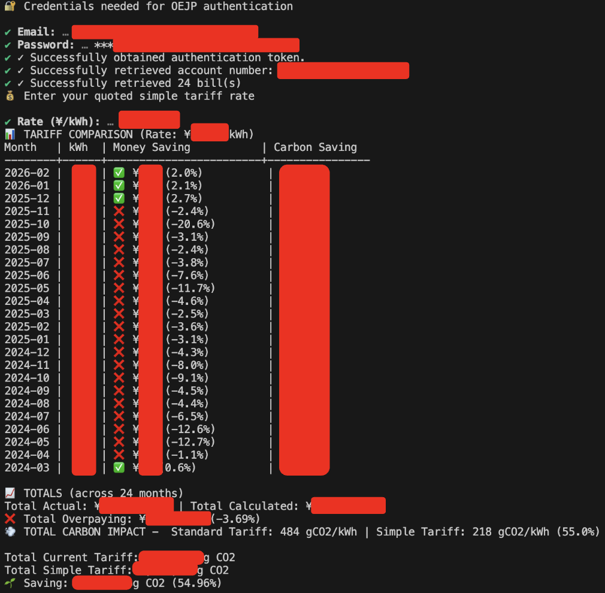

# 💡 OEJP Simple Tariff Compare

**Analyze your Octopus Energy Japan bills and discover hidden savings with the Simple Tariff.**

Compare your actual costs against Octopus Energy's Simple Tariff to see how much you could save. Get detailed month-by-month breakdowns, cost comparisons, and carbon impact analysis—all from your terminal.

## ✨ Features

- 📊 **Month-by-Month Comparison** – See exactly which months you're overpaying
- 💰 **Cost Analysis** – Calculate total savings across all your bills
- 🌱 **Carbon Impact** – Understand the environmental cost differences between tariffs
- 🚀 **Fast & Reliable** – Built with Bun for blazing-fast performance
- 🔐 **Secure** – Your credentials stay local, all data processed on your machine

## 📸 Demo



## Prerequisites

- [Bun](https://bun.sh) installed on your system

## 🚀 Quick Start

### Installation

Download the latest binary from [Releases](../../releases) or build it yourself:

```bash
git clone <repo>
cd oejp-simple-tariff-compare
bun install
bun run build
```

### Setup

1. Create a `.env` file with your OEJP credentials:

```bash
cp .env.example .env
```

2. Edit the `.env` file:

```env
OEJP_EMAIL=your-email@example.com
OEJP_PASSWORD=your-password
```

### Usage

**With Bun:**
```bash
bun run start
```

**With compiled binary:**
```bash
./oejp-simple-tariff-compare
```

**Or specify a custom rate (¥/kWh):**
```bash
SIMPLE_RATE=28.5 bun run start
```

## 📊 What You Get

The tool provides comprehensive analysis including:
- Individual month comparisons with savings percentages
- Total savings across all months
- Carbon intensity breakdowns by energy source
- Easy-to-read table output with emoji indicators (✅ saving / ❌ overpaying)

## 🔧 Development

### Scripts

- `bun run start` – Run the CLI
- `bun run build` – Build the executable
- `bun run release` – Build and create a GitHub release

### Building GraphQL Schema

If you want to develop locally against the actual API spec, you can download the GraphQL schema like this:

```bash
bun install
bun run apollo schema:download --endpoint=https://api.oejp-kraken.energy/v1/graphql/\#query\=\&variables\= schema.json
```

## 📝 Environment Variables

- `OEJP_EMAIL` – Your OEJP account email
- `OEJP_PASSWORD` – Your OEJP account password
- `SIMPLE_RATE` (optional) – Custom tariff rate in ¥/kWh (skips prompt if set)

## 📄 License

GNU GPLv3

